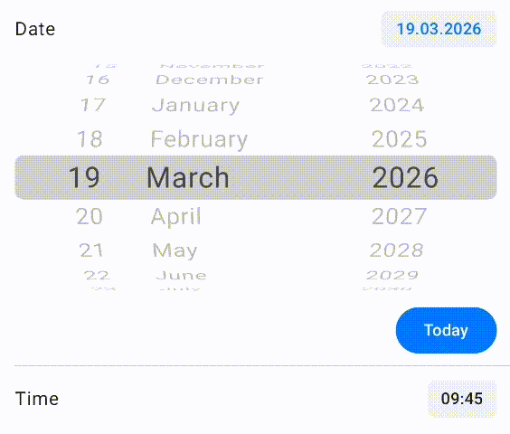

# Android WheelPicker
Example of an iOS implementation UIPickerView in JetpackCompose

## Preview
 


## Features
- iOS like behavior - smooth scrolling with inertia and snapping the selected element
- Customization - colors, visible items, curve rate
- Infinite list support
- Observable state
- Programmatically selectable index
- 3D cylinder effect with adjustable curvature

## Implementation
Implementation steps are described in my [article](https://habr.com/ru/articles/986270/).

## Latest Release
[](https://search.maven.org/search?q=g:io.github.plovotok)

## Usage
`libs.versions.toml` file:
```toml
[versions]
#...
wheel = "$latest"

[libraries]
#...
wheel-picker = { module = "io.github.plovotok:android-wheel-picker", version.ref = "wheel" }
```

`build.gradle.kts` file:
```kotlin
dependencies {
    implementation(libs.wheel.picker)
}
```

## Examples

### Single picker

```kotlin
val list = remember {
    buildList {
        repeat(10) { add("Item ${it + 1}") }
    }
}
val pickerState = rememberWheelPickerState(
    initialIndex = 4,
    infinite = false
)

WheelPicker(
    data = list,
    state = pickerState,
    overlay = OverlayConfiguration.create(
        scrimColor = MaterialTheme.colorScheme.background.copy(alpha = 0.7f),
    ),
    itemContent = {
        Text(
            text = list[it],
            style = MaterialTheme.typography.bodyLarge.copy(
                fontSize = 18.sp,
                textMotion = TextMotion.Animated
            ),
            color = MaterialTheme.colorScheme.onBackground,
        )
    }
)
```

### Multi picker

```kotlin
val list = buildList { repeat(10) { add("Item ${it + 1}") } }
val state1 = rememberWheelPickerState(2)
val state2 = rememberWheelPickerState(3)
val state3 = rememberWheelPickerState(4)

MultiWheelPicker(
    wheelCount = 3,
    wheelConfig = { wheel ->
        WheelConfig(
            data = list,
            state = when (wheel) {
                0 -> state1
                1 -> state2
                else -> state3
            }
        )
    },
    overlay = OverlayConfiguration.create(
        scrimColor = MaterialTheme.colorScheme.background.copy(alpha = 0.7f),
    ),
    itemHeightDp = 38.dp,
    itemContent = { _, listIndex ->
        Text(
            text = list[listIndex],
            color = MaterialTheme.colorScheme.onBackground,
            fontSize = 20.sp
        )
    },
)
```


### Custom Components

Some components built on top of `WheelPicker` / `MultiWheelPicker` that you can copy from the sample app.

#### Country picker


`WheelPicker` with flag + country name rows. Displays the selected country above the wheel.

See [`CountryPickerScreen.kt`](app/src/main/kotlin/github/plovotok/wheel_picker/navigation/screens/CountryPickerScreen.kt)

#### Date and time picker


`MultiWheelPicker` that allows you to select a date and time.

See [`DateAndTimeScreen.kt`](app/src/main/kotlin/github/plovotok/wheel_picker/navigation/screens/DateAndTimeScreen.kt)


#### Timer picker


`TimerPicker` — a three-column hours/minutes/seconds picker built on `MultiWheelPicker` with inline unit labels.

See [`TimerPicker.kt`](app/src/main/kotlin/github/plovotok/wheel_picker/navigation/screens/TimerPickerScreen.kt)

## License

```
Copyright 2026 Plovotok

Licensed under the Apache License, Version 2.0 (the "License");
you may not use this file except in compliance with the License.
You may obtain a copy of the License at

       http://www.apache.org/licenses/LICENSE-2.0

Unless required by applicable law or agreed to in writing, software
distributed under the License is distributed on an "AS IS" BASIS,
WITHOUT WARRANTIES OR CONDITIONS OF ANY KIND, either express or implied.
See the License for the specific language governing permissions and
limitations under the License.
```
